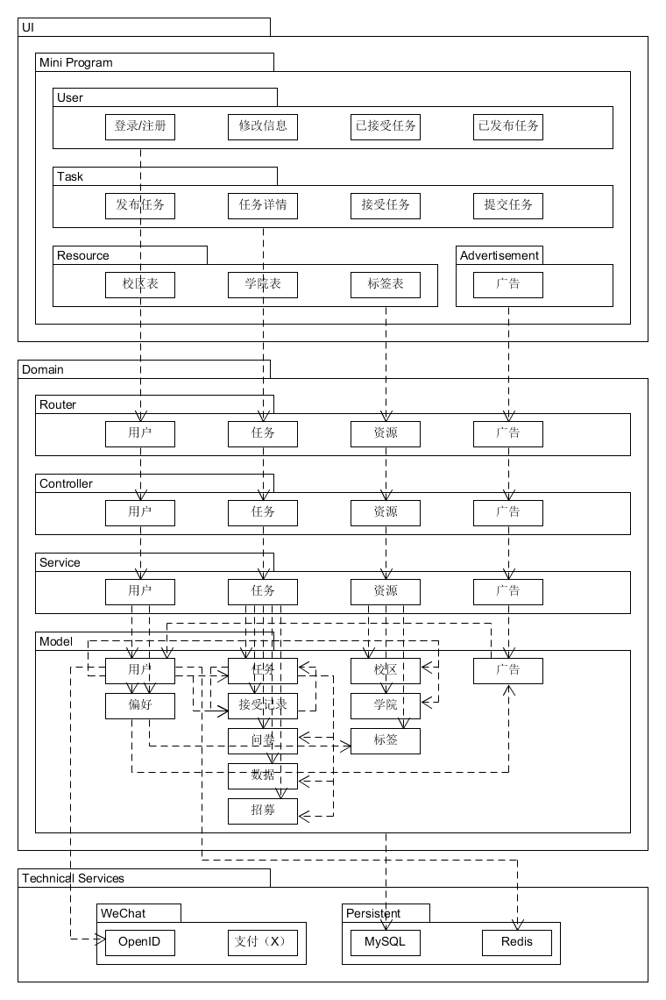
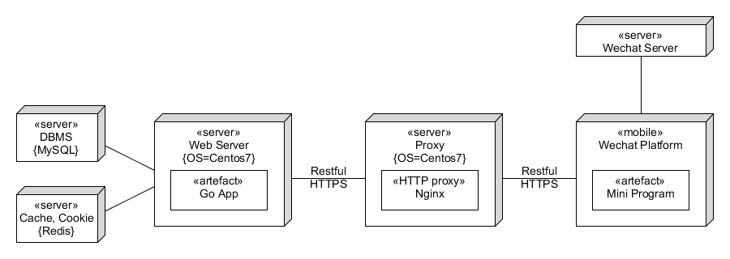

| 版本 |   日期    | 描述 |  作者   |
| :--: | :-------: | :--: | :-----: |
| v1.0 | 2019-06-20 | 上传逻辑视图、物理视图 | gitgiter |
| v1.1 | 2019-06-20 | 完成架构文档 | gitgiter |

## Software Architecture Document

### 架构问题

#### 服务端

##### 鉴权
作为一个服务多个用户角色的服务端：

如接收者和发布者，因此需要对API进行鉴权，其次是为了防止一些恶意攻击者和爬虫扰乱服务秩序。

发布者需要对任务完成结果进行审核，这个操作不允许接受者去做；同理，接受者提交任务时必须是作为之前接受过该任务的接受者。考虑到这样的鉴权需要，需要一个简单有效的鉴权方案。

##### 强大的框架
作为一个面向多用户的服务端：

首先必须要能承受住较大的访问流量（压力测试），其次是需要有强大的路由处理能力，包括路由分发和请求处理速度。

##### 可扩展的结构
作为一个具备可扩展性的服务端:

需要有良好的架构设计，至少能够做到服务分层或分模块，如路由、控制函数、数据模型、数据库、中间件等。这些模块也应该项目文件结构中得到体现。

##### 测试与部署
作为一个多环境集成的服务端：

为了简化测试和部署，可以利用自动化测试与部署。

##### 负载均衡与反向代理
作为一个可能需要承受大量访问压力的服务端：

需要一定的负载均衡能力，将访问请求分流到多个服务器，从而需要一个代理多个服务端的服务器，即反向代理。

同时，代理服务器可以将服务端与客户端隔离开来，甚至可以在服务端与代理服务器之间接入防火墙，进一步保证部署在内网的多个服务端的安全。

#### 客户端
待补充

### 解决方案说明

#### 服务端

##### 鉴权
使用中间件进行鉴权，在用户登录的时候会返回给客户端一个cookie，这个cookie里面包含用户的信息（已进行加密），对于那些需要鉴权的路由，在路由分发到处理函数前进行一个cookie认证，通过提取cookie中的用户信息结合数据库已有数据判断用户是否具有某些操作的权限。通过redis保存session。

##### 强大的框架
后端路由处理采用 [gin 框架](https://github.com/gin-gonic/gin)。

##### 可扩展的结构
具体的模块主要有路由、控制器、数据模型、数据库、中间件、工具包、日志存储等模块，详见项目文件结构。

##### 测试与部署
服务端测试采用 go test，部署采用 Docker 部署，因此可以快速部署多个服务端实例，每个实例监听不同的端口。

##### 负载均衡与反向代理
使用 Nginx 进行负载均衡和反向代理，管理 Docker 部署的多个实例。同时，Redis可以进行一些缓存操作，优化性能。

#### 客户端
待补充

### 逻辑视图

### 物理视图
