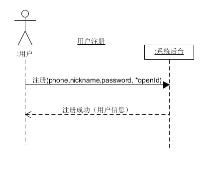
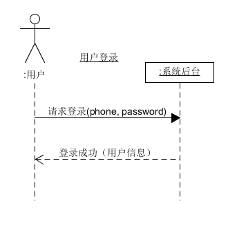
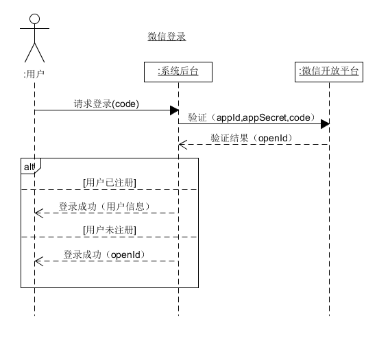
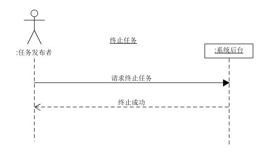
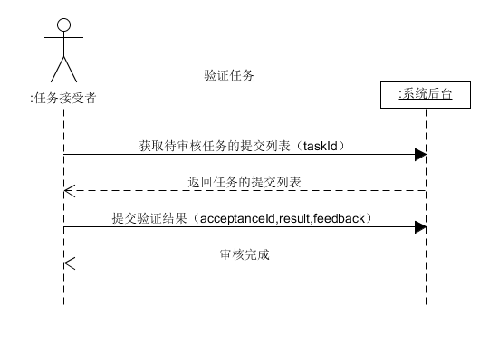
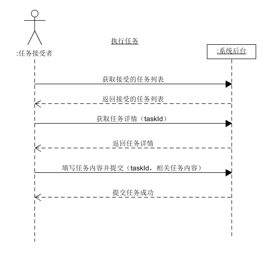
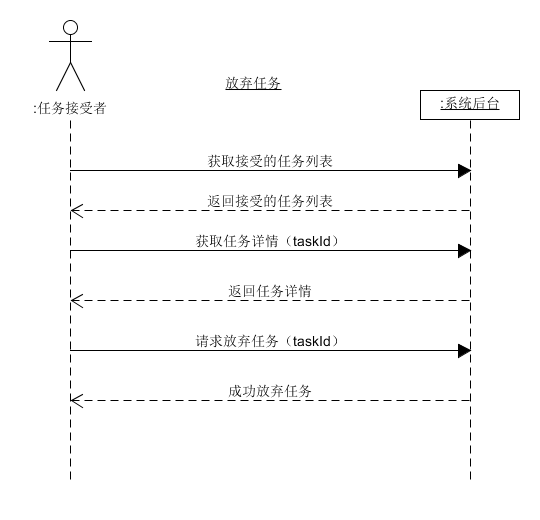
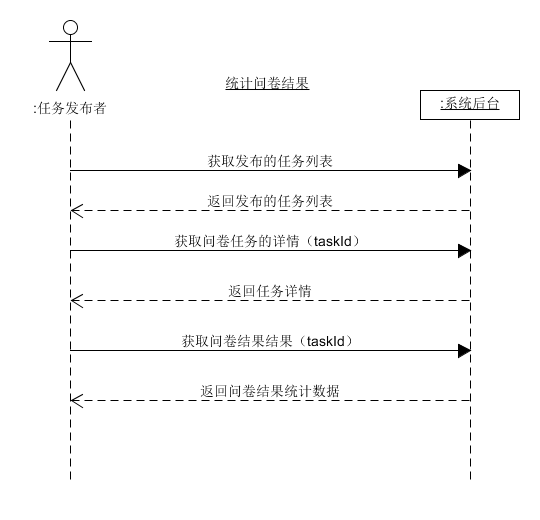
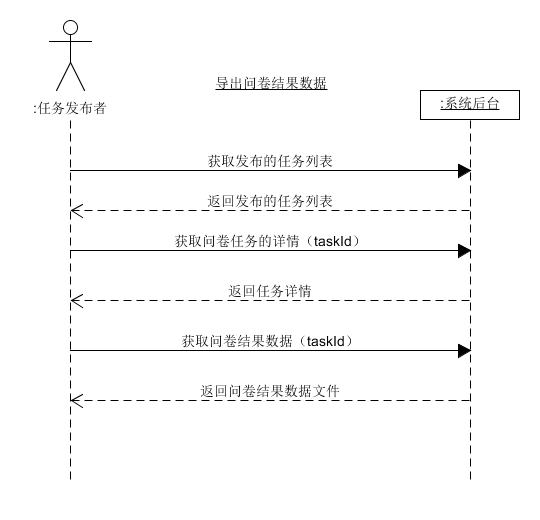
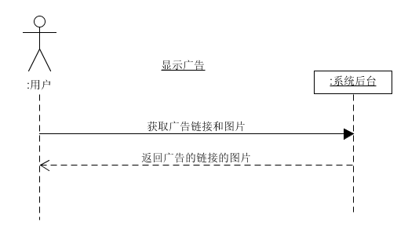

# System Sequence Diagram

| 版本 |   日期    | 描述 |  作者   |
| :--: | :-------: | :--: | :-----: |
| v1.0 | 2019-5-10 | 功能建模 | Young |
| v2.0 | 2019-6-10 | 拓展用例的功能建模 | young|
| v2.1 | 2019-6-27 | 修订 | young|

- 用户注册

- 用户登录

- 微信登录

- 修改用户资料

- 发布任务

- 终止任务

- 验证任务

- 接受任务

- 执行任务

- 放弃任务

- 统计问卷结果

- 导出问卷结果数据

- 显示广告

