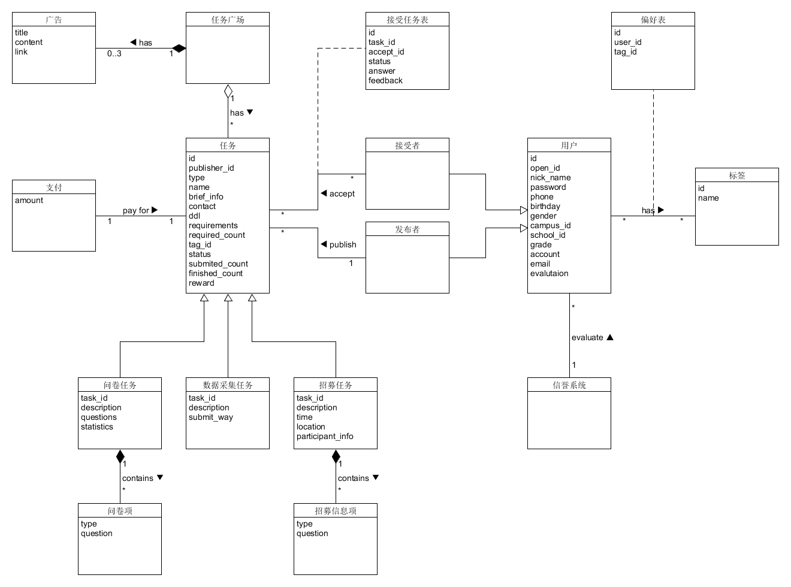

## 领域模型

{:.no_toc}

* 目录
{:toc}

### 编辑历史
| 版本 |   日期    | 描述 |  作者   |
| :--: | :-------: | :--: | :-----: |
| v1.0 | 2019-04-16 | 领域模型雏形 | gitgiter |
| v1.1 | 2019-04-16 | 拆分用户 | gitgiter |
| v1.2 | 2019-05-03 | 增加箭头，独立支付模块，增加待完成任务模块 | gitgiter |
| v2.0 | 2019-05-22 | 删除待完成任务模块，增加多对多关系表，填充字段，修改任务提交方式 | gitgiter |

### 领域模型图
