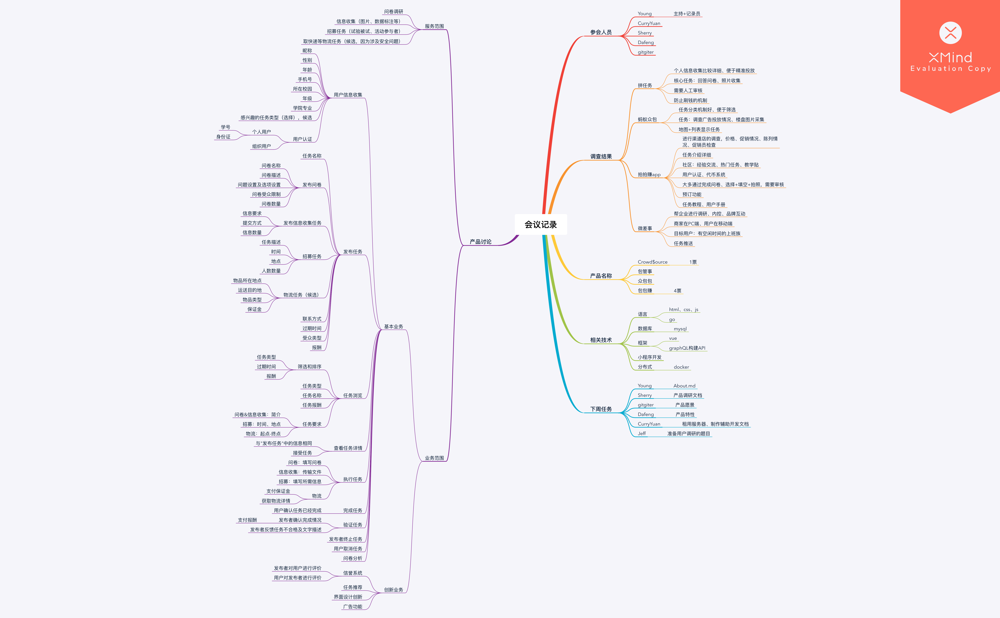

# Inception Meeting Record

{:toc}
## 会议目标
对产品进行初步构想，就产品范围、愿景和核心业务达成一致

## 参会人员
Young、Dafeng、CurryYuan、gitgiter、Sherry

记录员：Young

## 会议议程
1. 展示产品调研结果
2. 产品讨论：产品名称、服务范围、业务范围
3. 定义产品
4. 分析涉及的相关技术与潜在风险
5. 安排下阶段任务
   
## 讨论结果

## 会议不足
在产品讨论部分讨论过细，超出比较多的时间。