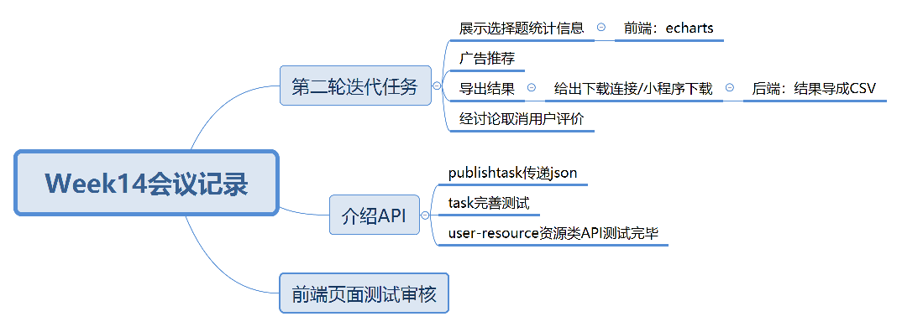

| 时间           | 参会人员                                         | 记录员 |
| -------------- | ------------------------------------------------ | ------ |
| 2019.6.2 10:00 | Young、Dafeng、CurryYuan、gitgiter、Sherry、Jeff | Sherry |

## 会议目标

- 验收第二轮迭代任务，进行更细致的规范

## 会议议程

1. 总结现阶段inception未完成的部分
2. 讨论精简功能

## 讨论结果

1. 前端使用echarts实现展示选择题统计信息
2. 导出结果使用下载链接，由后端导出csv
3. 取消用户评价

## 会议记录思维导图

