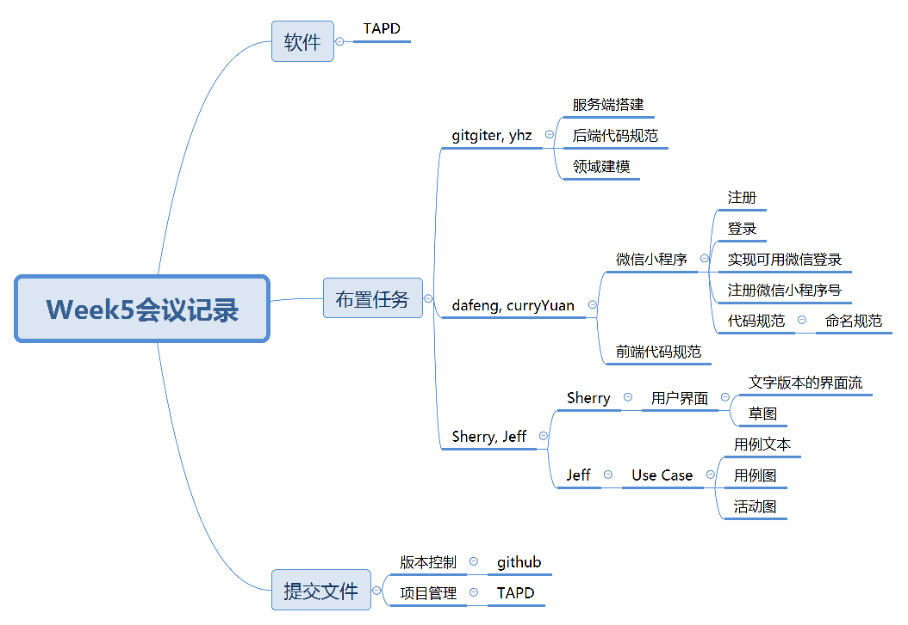

| 时间            | 参会人员                                   | 记录员 |
| --------------- | ------------------------------------------ | ------ |
| 2019.3.31 10:00 | Young、Dafeng、CurryYuan、gitgiter、Sherry | Sherry |

## 会议目标

- 对于产品的实现进行工具和平台上的定位，初步分工

## 参会人员

- Young、Dafeng、CurryYuan、gitgiter、Sherry

- 记录员：Sherry

## 会议议程

1. 确定软件实现平台
2. 确定迭代过程中的管理以及团队合作工具
3. 确认小组分工
4. 确定每一部分**本周**的任务

## 讨论结果

1. 实现平台为微信小程序
2. 版本管理使用Github
3. 项目管理使用TAPD

## 分工结果

1. 后端：gitgiter, Young

   任务：

   1. 初步搭建服务端
   2. 设计后端代码规范
   3. 着手领域建模

2. 前端：dafeng, curryYuan

   任务：

   1. 熟悉微信小程序
   2. 在微信小程序上初步实现注册与登录
   3. 尝试实现微信登录
   4. 注册微信小程序号
   5. 设计前端代码规范 - 主要为命名规范

3. 产品：Jeff

   1. 完成用例文本、用例图、活动图

4. UI：Sherry

   1. 完成纸质版本的草图，主要是页面跳转逻辑

## 会议记录思维导图

