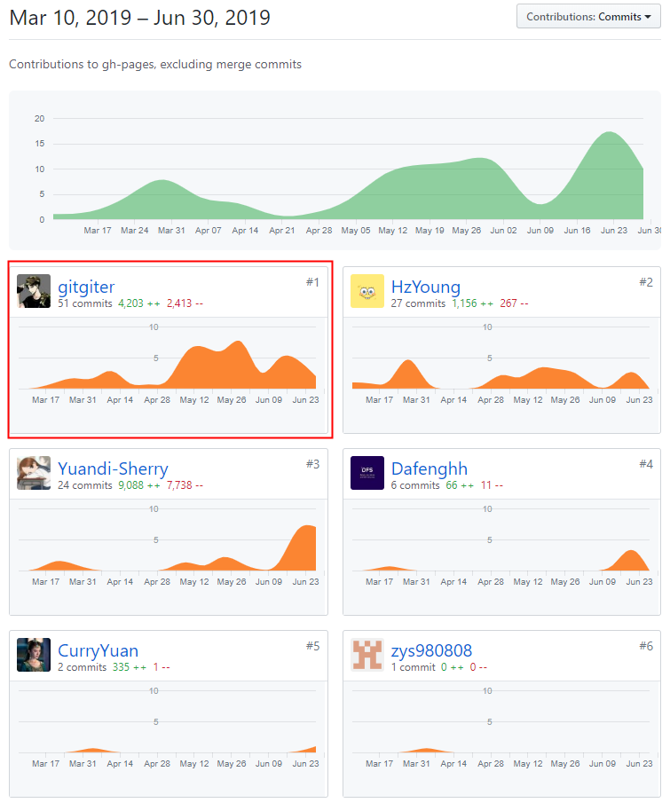
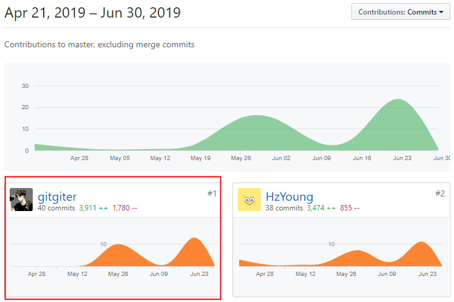

## 个人小结

---

学号：16340255
昵称：gitgiter

---

### 主要工作：架构设计 + 后端 + 测试

以下按时间顺序：

1. [项目愿景文档](../vision.md)

2. [后端代码规范](../后端代码规范.md)
    - [go语言代码规范](../后端代码规范.md#go语言编写规范)    
    - [数据库规范](../后端代码规范.md#数据库规范)
    - [api设计规范](../后端代码规范.md#接口规范) 

3. **[领域建模及其文档](../domain-model/README.md)**

4. **[整个Restful API设计及其文档编写](../api/README.md)**

5. **后端所有路由分发及其处理函数实现**
   - [router](https://github.com/swsad-dalaotelephone/Server/tree/master/router)
   - [controllers](https://github.com/swsad-dalaotelephone/Server/tree/master/controllers)
        - [用户](https://github.com/swsad-dalaotelephone/Server/tree/master/controllers/user)
        - [任务](https://github.com/swsad-dalaotelephone/Server/tree/master/controllers/task)
        - [资源](https://github.com/swsad-dalaotelephone/Server/tree/master/controllers/resource)
        - [广告](https://github.com/swsad-dalaotelephone/Server/tree/master/controllers/ad)

6. [BCE文档](../BCE.md)

7. **[架构设计及其文档](../SAD/SAD.md)**

8.  **[软件设计技术文档（后端部分）](https://swsad-dalaotelephone.github.io/SE-308/%E8%BD%AF%E4%BB%B6%E8%AE%BE%E8%AE%A1%E6%96%87%E6%A1%A3.html)**

9.  **api测试，前后端对接**

10. **docker构建镜像和一键部署**
    - [Dockerfile](https://github.com/swsad-dalaotelephone/Server/blob/master/Dockerfile)
    - [docker-compose.yml](https://github.com/swsad-dalaotelephone/Server/blob/master/docker-compose.yml)

### PSP2.1 表

| 项目 | time(%) |
| :---: | :---: |
| **计划** | **5** |
| 估计任务时间 | 5 |
| **开发** | **85** |
| 分析需求 | 3 |
| 生成设计文档 | 10 |
| 设计复审 | 9 |
| 代码规范 | 6 |
| 具体设计 | 20 |
| 具体编码 | 25 |
| 代码复审 | 2 |
| 测试 | 10 |
| **报告** | **10** |
| 测试报告 | 5 |
| 计算工作量 | 2 |
| 事后总结 | 3 |

### 最xxx的工作

#### 最有价值/最得意的工作

最有价值的工作非 **API 设计** 莫属，其次是 **领域建模**。第一次做架构设计相关工作，当时做着的时候也是想得头大，前期很长一段时间一直修修补补才有现在的 **API 设计** 和 **领域模型**，经过实践检验，确实是行得通的，并且较为合理和巧妙利用了cookie。但是 API 设计经过一次大翻车，就是之前看错 **Restful规范** 的要求，导致后面 API 大改。最后，API上线前经过很多测试，保证 API 没有出什么大bug，后面前后端对接确实很顺利。

#### 最有苦劳的工作
一个是 API 文档手敲一千多行，另一个就是后端根据 API 实现所有 controllers 及其 router，没有特别难的技术点，就是写写路由再处理下逻辑。

### 个人博客

- [16340255-MySQL安装配置及基本操作](https://gitgiter.github.io/2019/06/18/MySQL安装配置及基本操作)

- [16340255-Swagger简单使用心得](https://gitgiter.github.io/2019/06/01/Swagger简单使用心得)

- [16340255-Docker工作原理及常用操作](https://gitgiter.github.io/2019/06/26/Docker工作原理及常用操作)

- [16340255-Docker构建MySQL镜像并初始化](https://gitgiter.github.io/2019/06/29/Docker构建MySQL镜像并初始化)

- [16340255-Docker-Compose一键部署](https://gitgiter.github.io/2019/06/30/Docker-Compose一键部署)

### 贡献记录

#### 文档

#### 后端

### 特别感谢

特别感谢项目经理+后端的泓臻大佬，对项目整体进度把控很好，早早就开始组织每周项目会了，在队友有所懈怠的时候仍坚持推动项目，后端数据库也是很稳。

特别感谢UI设计师远迪大佬，我们组男生审美堪忧hhh（~~或许是我选择后端的理由~~），幸好有远迪大佬carry，调研文档也写得很好。

特别感谢前端组，前端工作繁琐，页面多，前端也没有抱怨地一点点做好。

感谢所有队友，本次项目将会是我本科期间最得意的一个项目。