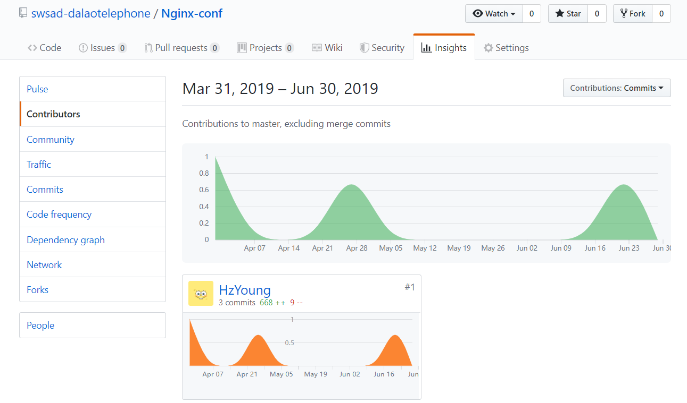

## 个人小结

| 学号     | 昵称   | 日期      |
| -------- | ------ | --------- |
| 16340269 | Young | 2019.6.29 |

### 自我总结
在这次项目中，担任了项目经理+产品经理+后端设计开发人员，虽然锅比较多，也有一些未曾涉足的领域，但是总体顺利完成，并且成品还是挺不错的让我很满意。
作为项目经理，虽然有进行项目规划，跟进进度，但是有些工作规划不合理，没有合理利用项目管理工具，出现没有及时完成，拖延工期的情况，是我需要反思总结的（见[播客](https://blog.csdn.net/weixin_43828428/article/details/94310464)）。
作为产品经理，完成了用例建模和功能建模，但还不够规范和细致。在领域建模和gitgiter进行了深入探讨。因为忙于后端开发，状态建模和补充需求的锅感谢sherry帮我背锅！
作为后端设计开发者，这是我最中意的部分，也是我最满意的部分，从设计到实现，果然打代码是一件让人快乐的事（虽然debug的时候依旧痛苦）。对于mysql有了更加深入的使用和了解，第一次接触服务器的相关配置，在摸索中前进，也很有收获。
### 主要工作

**项目管理**
- [项目概况](about.md)
- 管理项目进度 [KANBAN](../kanban.md)
- 组织会议[会议记录](https://github.com/swsad-dalaotelephone/docs/tree/gh-pages/meeting-record)
- 分配工作，根据实际情况调整分工安排 [team-profiel](../team-profile.md)

**需求分析**
- 用例[Use Cases](../use-case/README.md)
- 功能模型[System Sequence Diagrams](../SSD/README.md)

**设计**
- 数据库设计[Database design](imgs/db_design.png)
- 用例设计[Usecase design]()

**api服务器**
- 搭建基于go-gin的微信小程序api开发框架
- 云服务器、域名相关的购买、配置，[配置nginx](https://github.com/swsad-dalaotelephone/Nginx-conf)
- controllers的user部分和除controllers外的其他的部分编码(https://github.com/swsad-dalaotelephone/Server)
- [后端部署说明](https://github.com/swsad-dalaotelephone/Server/blob/master/README.md)
- go test单元测试，[以task为例](https://github.com/swsad-dalaotelephone/Server/blob/master/models/task/task_test.go)

**api测试，前后端对接**
在本地用postman/curl进行测试

### github 统计报告
我的user是HzYoung
- 小程序源码贡献

- 服务端源码贡献

- 文档制品贡献

- Nginx配置

### PSP2.1 表

| 项目 | time(%) |
| :---: | :---: |
| **计划** | **7** |
| 估计任务时间 | 7 |
| **开发** | **87** |
| 分析需求 | 10 |
| 生成设计文档 | 5 |
| 设计复审 | 5 |
| 代码规范 | 0 |
| 具体设计 | 10 |
| 具体编码 | 30 |
| 代码复审 | 7 |
| 测试 | 20 |
| **报告** | **6** |
| 测试报告 | 2 |
| 计算工作量 | 1 |
| 事后总结 | 3 |

#### 最得意的工作
作为项目经理早早地开始组织项目，项目稳步进行，十分顺利得带着我们小组完成了这个项目。这是我大学三年来最满意的一个项目！

#### 最有价值的工作
搭建了一个看起来不错用起来也不错的api开发框架，后端的开发进行得很顺利。

#### 最有苦劳的工作
写需求文档，当时时间紧任务重，不出需求文档大家都没法开工，我又不擅长语言表达，就花费了很多时间。

### 个人博客
 - [16340269-项目经理的成长历险记](https://blog.csdn.net/weixin_43828428/article/details/94310464)
 - [16340269-关于产品经理的一点心得体会](https://blog.csdn.net/weixin_43828428/article/details/94310582)
 - [16340269-基于go-gin的微信小程序api框架搭建](https://blog.csdn.net/weixin_43828428/article/details/94294049)

### 特别感谢

gitgiter完成了让人超级满意的api文档，反复修改特别辛苦。我们一起做设计，打后端，调试bug，gitgiter总能扛起大任，有种一起奋斗过的战友情。

Sherry，UI设计大佬，虽然需求一直有变动，但是一点都没有感到厌烦。保证了产品的审美！

CurryYuan、Jeff、Dafeng，前端页面多，各种跳转都挺麻烦的，辛苦三位了！

谢谢大家的辛苦付出和配合，作为项目经理，能和你们一起共事，我很幸运！
