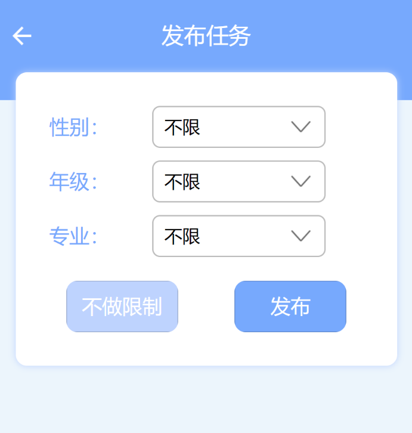

# 系统分析与设计个人报告

| 学号     | 昵称   | 日期      |
| -------- | ------ | --------- |
| 16340311 | Sherry | 2019.6.29 |

## 个人简短小节

这个项目中我的主要工作是UI设计顺带一点前端的页面布局代码部分，以及大部分会议的会议记录工作。在小组全员参与的工作中，我也积极提出自己的建议，比如用例设计的讨论以及承担部分会议结束后的绘图的遗留任务。

## PSP 2.1统计

|     项目     | time(%) |
| :----------: | :-----: |
|   **计划**   |  **5**  |
| 估计任务时间 |    5    |
|   **开发**   | **85**  |
|   分析需求   |    3    |
| 生成设计文档 |   10    |
|   设计复审   |    9    |
|   代码规范   |    6    |
|   具体设计   |   20    |
|   具体编码   |   25    |
|   代码复审   |    2    |
|     测试     |   10    |
|   **报告**   | **10**  |
|   测试报告   |    5    |
|  计算工作量  |    2    |
|   事后总结   |    3    |

## 主要工作清单

### UI部分

先展示UI部分的成果，使用墨刀软件制作的[原型图](https://org.modao.cc/app/f0ebac717798611817ec540d3532bab4#screen=sB92589E8A31557559884765).

#### 内容部分

UI设计是在用例文本出来了之后，需要根据用例划分页面，设计每个页面的布局以及整体风格。

##### 主要用例 - 发布和接受问卷

由于我们产品的主要用例为发布接受任务，因此我花费了比较长的时间设计这两部分，并且其中经过多次更改。

这里的难点在于：发布任务的过程较为自由，并且内容量不固定，因此需要较多用户自定义的过程，这就需要较多产品与用户的交互。

最终定下来是通过用户自主添加问题的方式在确保用例对应的内容的自由度的情况下保证了页面的美观性。

------

由于我们有不同的任务类型，但其中对于任务数量、报酬以及受众的限制这三个部分是共享的。为了使得用户使用时逻辑较为清晰，我将每个任务的基本信息填写页面和受众限制页面分离出来。在中间的页面，根据任务的具体类型进行不同的安排与设计。

##### 亮点用例 - 任务审核

经验表明，很多时候会有用户不认真完成任务，其填写的问卷对于发布者没有任何价值，但仍然可以获得报酬，因此我们特意加入了问卷的审核功能。这就涉及到审核列表的设计以及具体审核页面的设计。

###### 审核列表

审核列表采用了显示提交者姓名，以及在右上角用不同颜色banner标记问卷已审核或者未审核。这样一方面使得界面的配色有所丰富，也使得发布者对于问卷是否已经审核一目了然。

###### 审核页面

对于具体任务的审核，一方面我们要有视窗查看接受者的提交结果，另一方面还需要有填写反馈内容的地方。因此我设计的为将反馈评语放在最下面，并且在看完所有内容后再往下才出现评论框，使得发布者可以对于问卷的内容有最大的感受野，并且在最后需要提交审核结果的时候出现按钮。

#### 风格配色

参考了各大UI设计网站的配色后，我选择了这个界面颜色较为清新，而且整体布局很清晰且适当留白的界面。

由于是个人报告，UI就挑重点说了，如果需要看详细的UI设计，请移步[UI设计说明书](https://swsad-dalaotelephone.github.io/docs/ui-design.html)

#### 细节设计

UI设计除了整体的外观与逻辑，最重要的一点是用户体验，比如我设计了三种按钮风格：

1. 推荐风格
2. 候选风格
3. 禁用风格

顾名思义，禁用风格一般是在按钮不满足某种条件的时候直接为灰色背景并且无法点击。推荐风格我设计为醒目的蓝色（与主题色相呼应），并放在按钮组的右侧；而候选风格为浅蓝色，放在按钮组的左侧。考虑到大部分用户为右利手，就将用户更加频繁点击的按钮以及我们希望用户点击的按钮设计为醒目的颜色放在右侧。

<figure>
    
    
    
</figure>

------

我认为类似的小细节在UI设计方面还是很重要的，由于没有系统学习过交互设计，只是个半路出家的小UI，我的经验一般是根据自身使用过程中的观察得到的，如果有违背概念或者公理的地方欢迎指教。UI之路任重而道远~

#### 进度控制

这一次由于用例出了一点问题，需要反复讨论，拖延了进度。再设计UI的过程中真实感受到理论到实践的差距，看似合情合理无懈可击的用例，UI设计的时候还是会有很多不清晰、不确定、莫能两可需要再次开会讨论的地方。我觉得在这种老师按照进度引导着开发产品都会出现理论到实现的差距，更不要提我之前的作业都是想到哪里做到哪里，动不动就改需求，重构代码是多么低效和愚蠢了。

当用例和UI都确定了，前端就可以开工。毕竟多次修改的东西还是尽量控制在前面的阶段，等到代码实现了再修改重构就很耗费精力而且打击团队信心。

### 前端部分

由于我们组三个前端都是男孩子，对于UI外观的设计有些部分和原型还是有所差距，我主要调整了每个页面的具体颜色、参数以及元素的相对位置关系，并将三个前端的样式文件进行了整合。使得部分样式在多个界面复用，实现了风格统一以及布局的高效性。

### 最得意的工作清单

- UI

  > 个人认为UI还是挺好看的，也是我在这个项目中的主要工作，并且得到了我的组员的认可，还是很满意的。

### 最有价值的工作清单

- UI

  > UI是产品中必不可少的一部分，但是并不是程序员的必备属性，所以能够在小组中凭借兴趣爱好承担这个别人会花费很大精力或者较难承担的工作还是比较有价值的。

### 最有苦劳的工作清单

- 前端

  > UI虽然页面比较多，但是在设计过程中界面一直可视化，不会感觉很累；但是当拿到小程序前端的时候，由于三个前端非常优秀地独立完成了自己的界面，但是有些可以复用的地方没有复用，这个时候如果发现UI在一些尺寸的屏幕上不合适，则修改起来很麻烦。所以比较有劳苦的工作就是重构前端的样式表部分的代码。

## 在项目相关仓库中的贡献

### Docs

### miniProgram

## 个人博客清单

- [原型设计软件MockingBot学习笔记](https://yuandi-sherry.github.io/2019/05/18/原型设计软件MockingBot学习笔记/)

- [微信小程序开发学习笔记](https://yuandi-sherry.github.io/2019/06/27/微信小程序开发学习笔记/)

## 特别致谢

- 感谢组长大佬Young组织召开各种会议，帮助我们把控进度，最终完成项目
- 感谢Jeff在我修改前端页面的时候指导我调试方法
- 感谢Dafeng以及组里所有大佬在测试中指出页面排版错乱的地方
- 感谢gitgiter搞后端，虽然我也不知道后端的具体工作，看起来都很难很麻烦的样子，总之他每次都完成得又快又好就是了
- 感谢Curry主持前端的分工并且每次都快速完成任务
- 感谢墨刀公司开发了如此好用的原型设计产品，并赠送我优惠券企图让我包年