# UI设计说明书

根据用例的设计，本文档主要分为以下几个部分介绍UI。

## 设计思路

由于是微信小程序，页面越简单越好，因此使用了较为清新的配色并且使得页面布局尽可能清晰一目了然，使得用户可以在即使不参能考用户手册的情况下也可以直接上手。

### 配色

- 主要颜色为明度和饱和度都较高的糖果色，使得整体风格比较轻松愉快。

### 布局

- 由于微信小程序比起web，界面较为狭小，因此需要在页面划分的时候费些心思，避免页面过长或者某个页面内容过多。
- 因此本次UI设计中在页面如何划分，什么情况下跳转也费了一些脑筋。

## 主要界面

### 底边栏

根据底边栏可以看出我们的小程序主要分为三个页面：

1. 首页
2. 任务
3. 我的

### 主页（任务广场）

任务广场为用户寻找合适自己的任务的地方，页面上为推广内容，可以是社团广告或者最近比较需要宣传的任务。

---

下方为当前进行中的任务，考虑到任务可能比较多，我们按照用例设计中的三种任务类别：问卷、信息收集和招募对任务进行分类：

1. 将不同的任务配以不同的图标在任务广场展示

   

2. 在任务广场上方添加分类栏目，方便用户筛选出不同的任务

   <figure>
       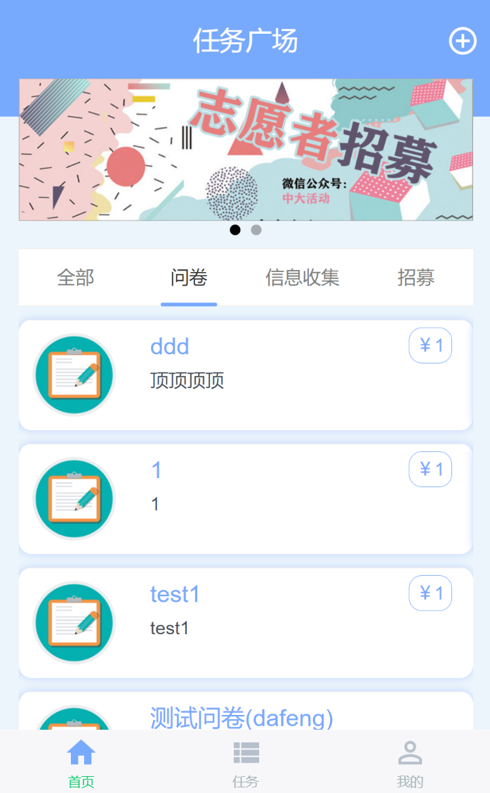
       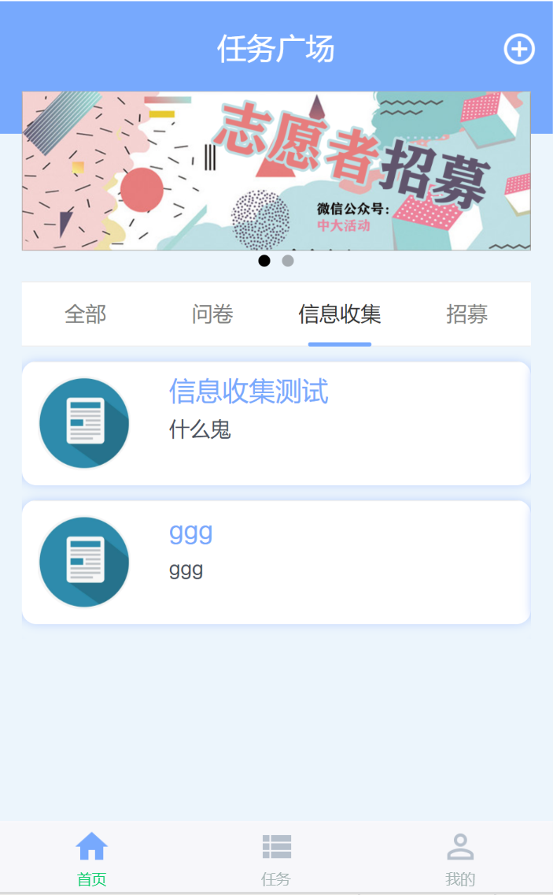
       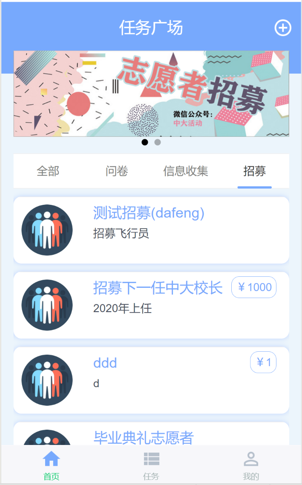

   </figure>

----

对于每个任务在任务广场中的展示，UI的设计也让人一目了然：

1. 任务名称 - 选择和主题色一样的蓝色突出任务名称
2. 任务报仇 - 使用显眼的圆角矩形框标明任务的报酬
3. 任务简介 - 由于任务名称长度有限，简介对于在任务广场上了解任务有一定帮助，使用浅灰色使得简介不会喧宾夺主

---

当用户上滑这一页，任务列表会布满屏幕，使得用户在浏览过广告后，对于任务列表的感受视野变大，不至于在狭小的空间内频繁滑动才能浏览任务。

### 任务

由于每个中大学生有可能称为任务的发布者也可能成为任务的接受者， 因此对于两种角色都需要对自己的任务进行管理。这部分会在功能界面详细说明。

> 任务广场和我的任务界面右上角的小加号都可以用来发布新任务

### 我的

我的界面主要就满足对于账户信息的管理以及查看新手教程等等附加功能。

## 功能界面

### 发布任务

点击主页面和任务页面右上角的加号即可发布任务

#### 基本信息

基本信息包括：

1. 任务类型 - 分为问卷、信息收集和招募

   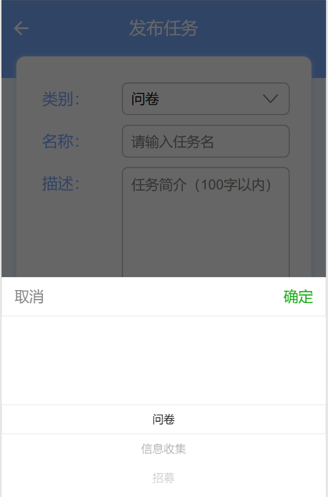

2. 任务描述

3. 任务报酬

4. 需求数量

5. 推荐标签

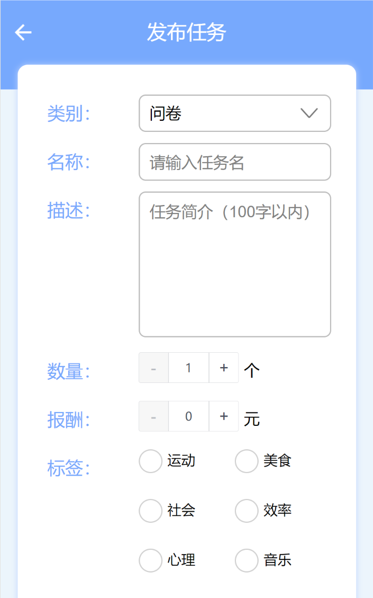

#### 发布问卷

发布问卷需要有详细的问卷描述，比如问卷的调查目的以及发布者对于接受者隐私问题的承诺等等。这已经超出简介的范围，需要详细填写。

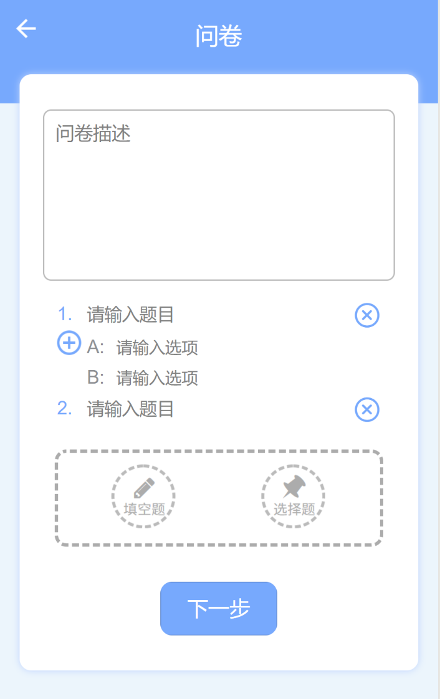

此外，问卷的重点就在于题目的设计：

1. 选择题

   <figure>
       
       
   </figure>

   1. 添加选项 - 点击左侧加号
   2. 删除选项 - 点击新选项后的删除符号

2. 添加填空题

   

3. 删除题目 - 点击题目右侧的删除符号

   这里为了避免误操作，添加了二次确认：

   

#### 发布信息收集和发布招募

<figure>
    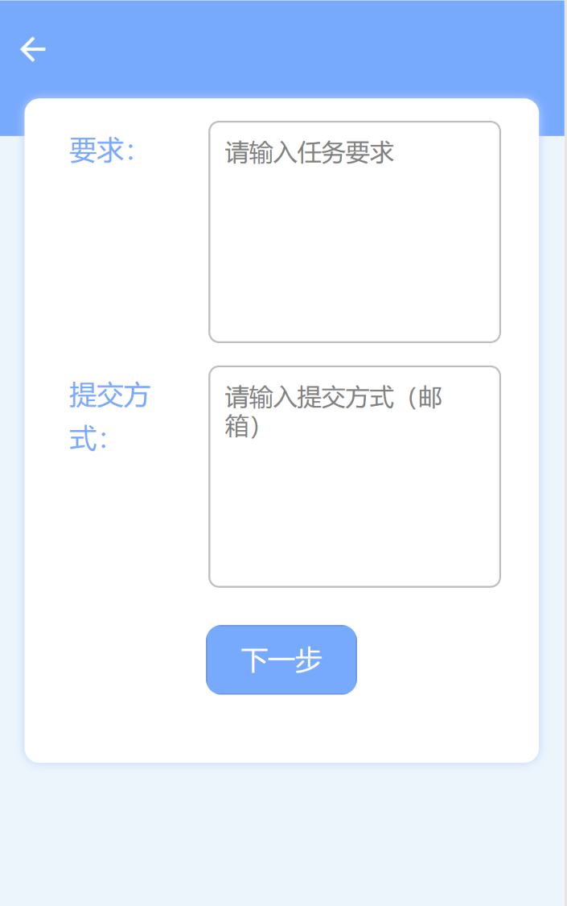
    
</figure>

- 信息收集内容较少，主要是提供者和收集者对于资料的邮件往来。只需要发布者说明需求并且留下提交方式即可。

- 招募和问卷类似，但由于招募的活动一般是有时间的，因此我们会加入一个对于时间的选择，并且设计组件：

​		此外由于每次招募需要被招募者提供的信息有所出入，比如有的需要姓名、有的需要学号、有的需要手机号还有的需要身份证号。这里我们就留给发布者进行自定义（和问卷的添加问题相似）。

#### 问卷受众限制

有些任务对于接受任务的群体会有一定限制，因此为了使得任务精准投放，我们的设计中特别在发布任务的最后加入了对于受众的限制：

点击不做限制可以一键清楚上面的限制。

此外，针对每种限制的不同类型，我们做了不同的UI：

<figure>
    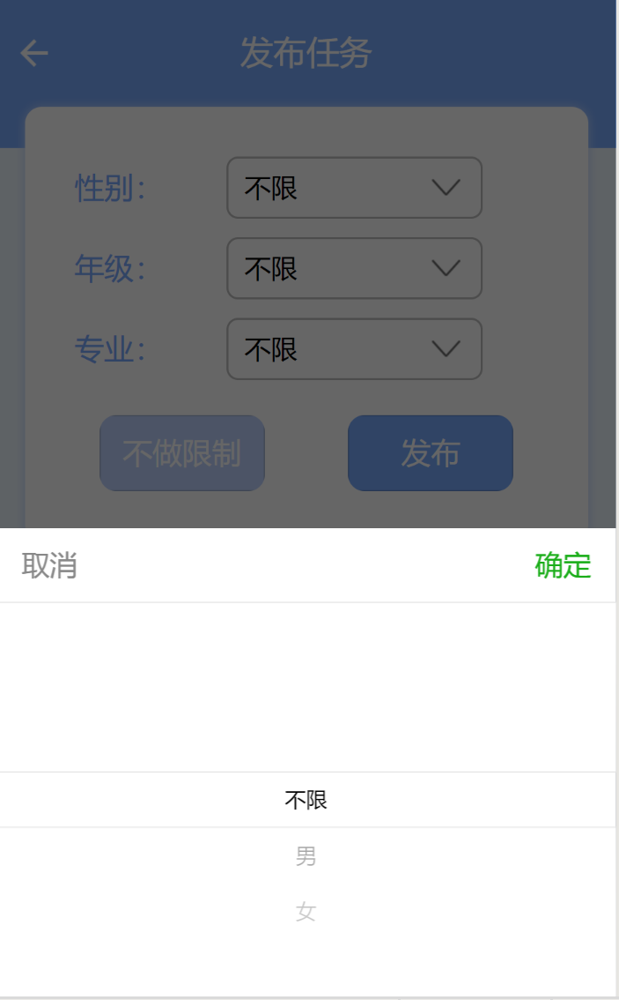
    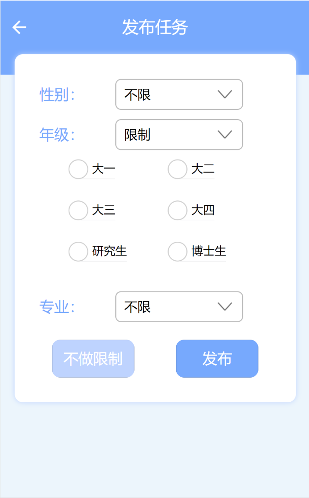
</figure>

- 性别 - 单选 - 下拉选择
- 年级 - 可多选 - 多选框

### 接受任务

任务广场中点击任何一个任务卡片都可以进入接受任务的页面，为了方便用户，我们提供了两个选项：

1. 暂时接受 - 加入我接受的，并设定状态为待完成
2. 马上执行 - 直接执行，提交后为以待审核的状态加入我接受的

这里由于我们更倾向于接受任务的用户速战速决马上执行，因此会将我们倾向于让用户点击的按钮变为深蓝色，不是很希望用户点击的按钮为浅蓝色：

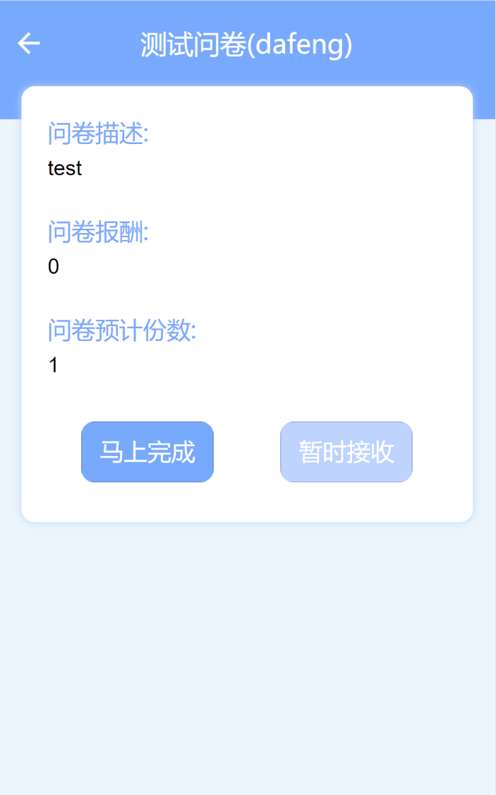

这一部分的将问卷的基本信息分离出来，使得用户能够了解任务的基本情况，但是不至于看到问卷的详细内容，一方面处于对发布者隐私的保护，另一方面避免给用户提供冗余信息违背我们简约明快的设计风格。

### 执行任务

执行任务的情况有下面两种：

1. 在任务广场选择了任务并马上执行
2. 在我接受的列表中选择任务并马上执行

不过实际上执行过程都是一样的：

由于这里是测试问卷，只添加了两个问题，实际过程中可以添加多个问题，这个可以从发布者的角度在`发布问卷`的UI设计模块查看。

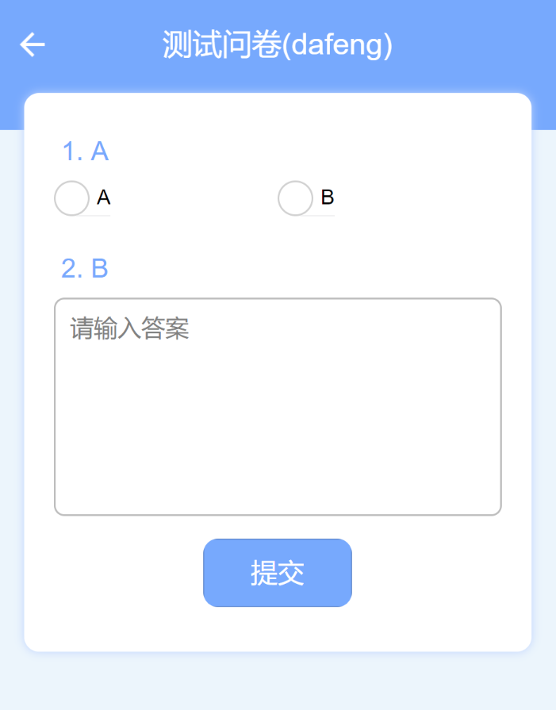

### 放弃任务

放弃任务是在接受任务后可以选择放弃，但实际上我们并不希望用户放弃任务，所以在进入我接受的某个任务时，放弃按钮使用的是我们不希望用户点击的浅蓝色。

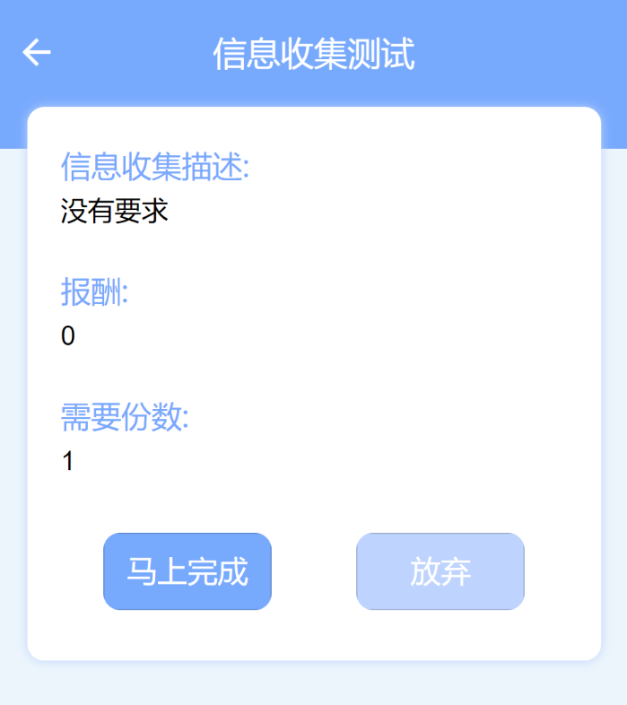

### 审核任务

审核任务是本产品的特色功能，经验表明有很多人会盲目填写、随意填写问卷，快速刷很多报酬。因此我们给予发布者审核问卷的权力，对于不合格的问卷可以拒绝支付，并且让接受者重新修改提交。

在**任务 - 我发布的**点击某个发布的具体任务就可以看到提交列表：

<figure>
    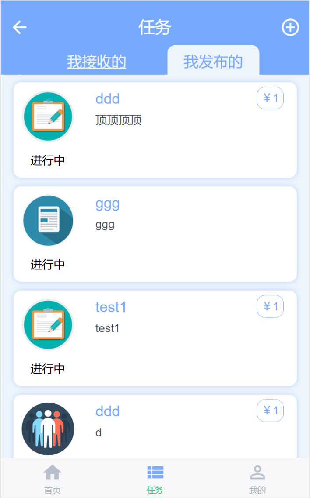
    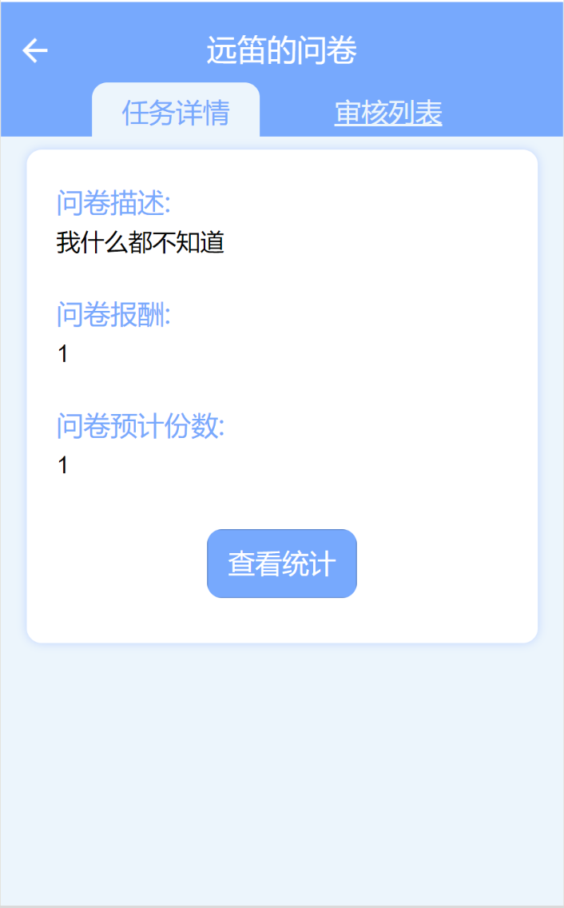
    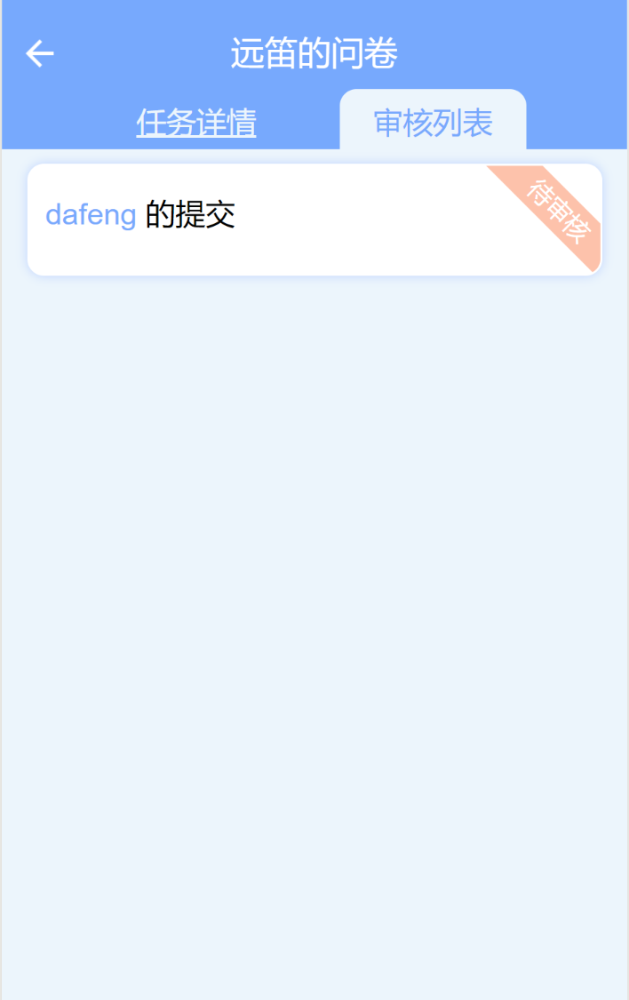

</figure>

点击一个具体的提交，可以看到接受者提交的内容并决定是否审核通过。

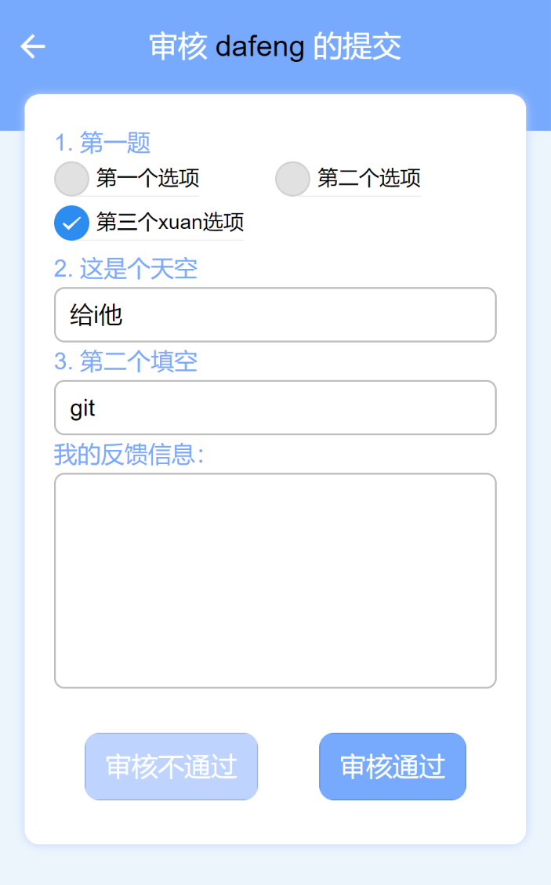

在审核列表中，我们采用橙色和绿色代表已经审核和还未审核的提交，使其一目了然

### 数据统计

对于发布者来说，查看最后的结果十分重要，我们添加了查看统计的功能，从**我发布的 - 任务详情 - 查看统计**可以看到：

<figure>
    
    
</figure>

这里UI的设计是使用饼图显示选择题的统计结果，使用列表显示填空题的统计结果。

## Reference

排版及配色参考：https://www.ui.cn/detail/199423.html