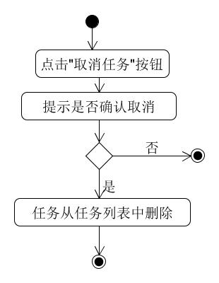

# 用例：取消任务

| 版本 |   日期    | 描述 |  作者   |
| :--: | :-------: | :--: | :-----: |
| v1.0 | 2019-5-6 | 详细用例 | Young |

---
## 用例文本
**用例：** 取消任务

**范围：** 包包赚用户客户端

**级别：** 用户目标

**主要参与者：** 任务接受者

**涉及其关注点：**

- 任务接受者：不想继续完成该任务

**前置条件：**
任务接受者已经接取了该任务

**后置条件：**
该任务从任务接受者的任务列表中删除

**主成功场景：**
1. 从"任务详情"界面中进入"任务执行"界面
2. 选择取消任务

**拓展：**

**特殊需求：**

**技术与数据变元表：**

**发生频率：** 较少

**未决问题：**

## 活动图

